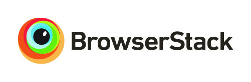

# Delphi Search Web Application

A web UI for the Delphi platform.

We are currently in pre-alpha state! There is no release and the code in
this repository is purely experimental!

|branch | status | codacy |
| :---: | :---: | :---: |
| master | [](https://travis-ci.org/delphi-hub/delphi-webapp) | [](https://www.codacy.com/project/delphi-hub/delphi-webapp/dashboard?utm_source=github.com&amp;utm_medium=referral&amp;utm_content=delphi-hub/delphi-webapp&amp;utm_campaign=Badge_Grade_Dashboard)|
| develop | [](https://travis-ci.org/delphi-hub/delphi-webapp) | [](https://www.codacy.com/project/delphi-hub/delphi-webapp/dashboard?branch=develop&amp;utm_source=github.com&amp;utm_medium=referral&amp;utm_content=delphi-hub/delphi-webapp&amp;utm_campaign=Badge_Grade_Dashboard) |

## What is the Delphi Web UI?

It is a web application to allow users to search for software projects.

## How does it work?

TBA.

## How can I use it?

You can start your own instance by executing
```
sbt run
```

## Community

Feel welcome to join our chatroom on Gitter: [](https://gitter.im/delphi-hub/delphi?utm_source=badge&utm_medium=badge&utm_campaign=pr-badge&utm_content=badge)

## Contributing

Contributions are *very* welcome!

Before contributing, please read our [Code of Conduct](CODE_OF_CONDUCT.md).

Refer to the [Contribution Guide](CONTRIBUTING.md) for details about the workflow.
We use Pull Requests to collect contributions. Especially look out for "help wanted" issues
[](https://github.com/delphi-hub/delphi-webapp/issues?q=is%3Aopen+is%3Aissue+label%3A%22help+wanted%22),
but feel free to work on other issues as well.
You can ask for clarification in the issues directly, or use our Gitter
chat for a more interactive experience.

[](https://github.com/delphi-hub/delphi-management/issues)


## License

The Delphi Web Application is open source and available under Apache 2 License.

[](https://github.com/delphi-hub/delphi-webapp/blob/master/LICENSE)

## Credits

[](http://www.browserstack.com "BrowserStack")

Special thanks to BrowserStack for sponsoring this project and giving it more substantial cross-browser capabilities.
